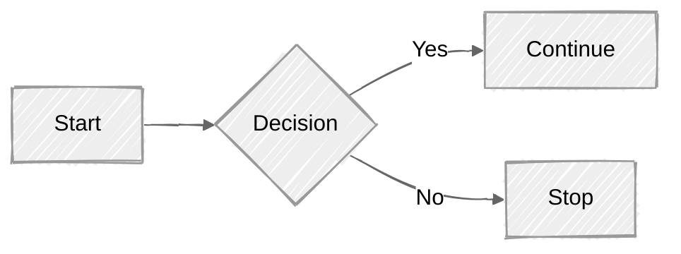

Official Mermaid documentation here:
|
https://mermaid.js.org/intro/

---

# Mermaid Option 2

# Hello
Isn't this cool Cole?

'''mermaid
graph TD
    A[Enter Chart Definition] --> B(Preview)
    B --> C{decide}
    C --> D[Keep]
    C --> E[Edit Definition]
    E --> B
    D --> F[Save Image and Code]
    F --> B
'''

---
config:
  look: handDrawn
  theme: neutral
---
flowchart LR
  A[Start] --> B{Decision}
  B -->|Yes| C[Continue]
  B -->|No| D[Stop]
