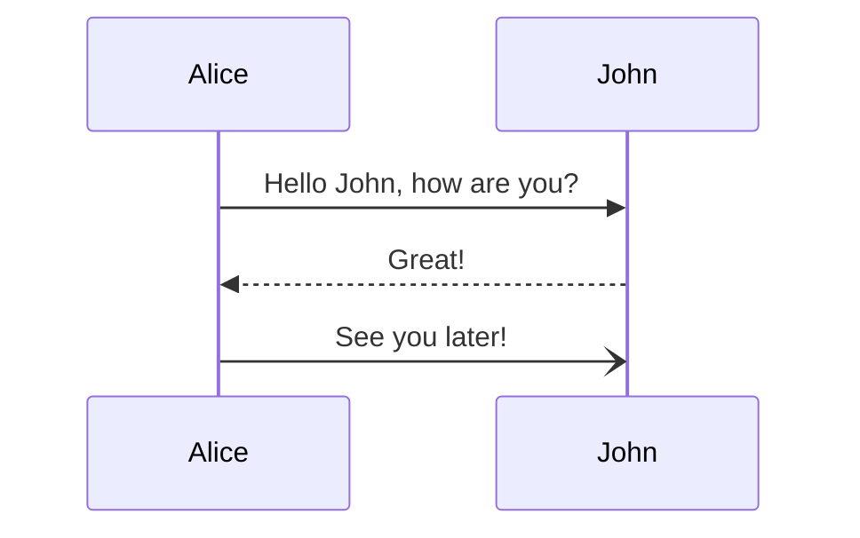
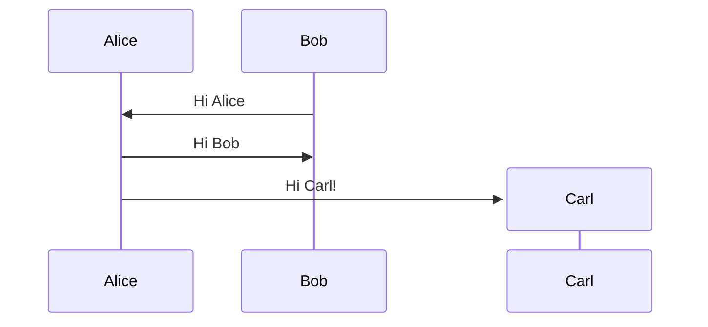

___
# EX 1

```mermaid
sequenceDiagram
    Alice->>John: Hello John, how are you?
    John-->>Alice: Great!
    Alice-)John: See you later!
```
___
# EX 2

```mermaid
sequenceDiagram
    participant Alice
    participant Bob

    Bob->>Alice: Hi Alice
    Alice->>Bob: Hi Bob
    
    create participant Carl
    Alice->>Carl: Hi Carl!


```

___
# EX _
```mermaid

```