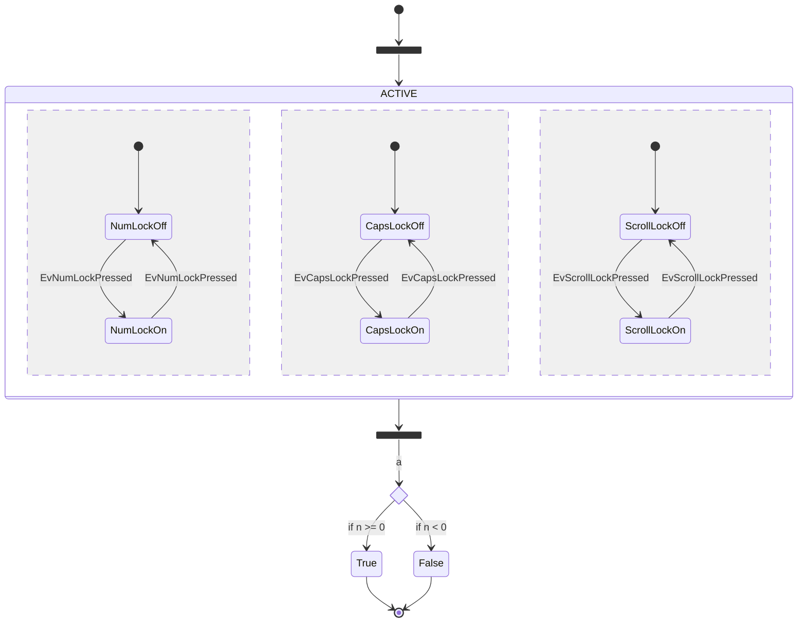

# State Flow Charts

## EX 1

```mermaid
stateDiagram-v2
    state if_state <<choice>>
    state fork_state1 <<fork>>
    state join_state1 <<join>>
    state ACTIVE

    [*] --> fork_state1
    fork_state1 --> ACTIVE
        state ACTIVE {
        [*] --> NumLockOff
        NumLockOff --> NumLockOn : EvNumLockPressed
        NumLockOn --> NumLockOff : EvNumLockPressed
        --
        [*] --> CapsLockOff
        CapsLockOff --> CapsLockOn : EvCapsLockPressed
        CapsLockOn --> CapsLockOff : EvCapsLockPressed
        --
        [*] --> ScrollLockOff
        ScrollLockOff --> ScrollLockOn : EvScrollLockPressed
        ScrollLockOn --> ScrollLockOff : EvScrollLockPressed
    }
    ACTIVE --> join_state1

    join_state1 --> if_state:a
    if_state --> False: if n < 0
    if_state --> True : if n >= 0
    True --> [*]
    False --> [*]
```

## EX _
```mermaid

```