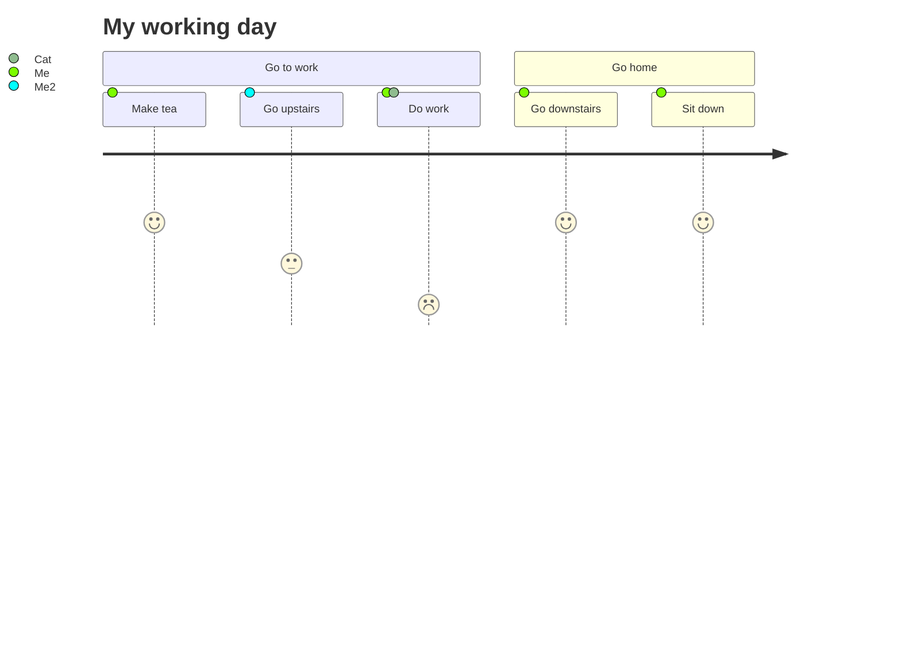

# State Flow Charts

## Syntax
Tasks syntax is:

Task name: <score>: <comma separated list of actors>

Scale: 1-10,

But Actuall: 1-5
___

## EX 1

```mermaid
journey
    title My working day
    section Go to work
        Make tea: 5: Me
        Go upstairs: 3: Me2
        Do work: 1: Me, Cat
    section Go home
        Go downstairs: 5: Me
        Sit down: 5: Me

```